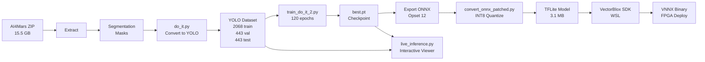

# Mars Object Detection - Technical Overview

## Project Summary

This project trains YOLO11n/YOLOv8n models on NASA's AI4Mars dataset to detect 4 terrain types (Soil, Bedrock, Sand, Big Rock) for deployment on VectorBlox FPGA hardware.

**Key Metrics:**
- Model: YOLO11 Nano (2.58M parameters, 6.3 GFLOPs)
- Input: 256×256 RGB images
- Performance: 42.72% mAP@50, 30.40% mAP@50-95
- Training time: 74 minutes on Apple M1 Max
- Target: VectorBlox FPGA (PolarFire SoC)

---

## 1. Data Processing Pipeline (From ZIP to YOLO Format)

### Source Dataset

**AI4Mars v0.6 Merged Dataset:**
- Location: `data/downloads/ai4mars-dataset-merged-0.6.zip` (15.5 GB)
- Content: Mars rover imagery from Curiosity/Perseverance with pixel-level segmentation masks
- Format: Images + corresponding segmentation masks (PNG)
- Classes: 0=Soil, 1=Bedrock, 2=Sand, 3=Big Rock, 255=Null

### Conversion Process: `do_it.py`

**Step-by-step conversion from segmentation masks to YOLO bounding boxes:**

```python
# 1. Extract ZIP file
# Manual extraction to: data/extracted/ai4mars/

# 2. Load segmentation mask (pixel-level labels)
mask = cv2.imread("label.png", cv2.IMREAD_GRAYSCALE)

# 3. For each terrain class (0-3):
for class_id in range(4):
    # Create binary mask for this class
    binary_mask = (mask == class_id).astype(np.uint8)
    
    # Find connected components (contiguous regions)
    contours, _ = cv2.findContours(binary_mask, cv2.RETR_EXTERNAL, cv2.CHAIN_APPROX_SIMPLE)
    
    # Filter small regions (< 100 pixels)
    for contour in contours:
        if cv2.contourArea(contour) >= 100:
            # Get bounding box
            x, y, w, h = cv2.boundingRect(contour)
            
            # Convert to YOLO format (normalized center coordinates)
            img_h, img_w = mask.shape
            x_center = (x + w/2) / img_w
            y_center = (y + h/2) / img_h
            width = w / img_w
            height = h / img_h
            
            # Save as: class_id x_center y_center width height
```

**Output structure:**
```
data/yolo_mars/
├── images/
│   ├── train/     # 2068 JPG files
│   ├── val/       # 443 JPG files
│   └── test/      # 443 JPG files
├── labels/
│   ├── train/     # 2068 TXT files (YOLO format)
│   ├── val/       # 443 TXT files
│   └── test/      # 443 TXT files
└── mars.yaml      # Dataset configuration
```

### Dataset Split

```python
# From do_it.py
from sklearn.model_selection import train_test_split

# Set random seed for reproducibility
np.random.seed(42)

# Sample 3000 images from full dataset
image_list = random.sample(all_images, 3000)

# Split: 70% train, 15% val, 15% test
train_imgs, temp_imgs = train_test_split(image_list, test_size=0.3, random_state=42)
val_imgs, test_imgs = train_test_split(temp_imgs, test_size=0.5, random_state=42)

# Result: 2068 train, 443 val, 443 test
```

### Dataset Configuration: `mars.yaml`

```yaml
path: /Users/scramer/Documents/mars_object_detection/data/yolo_mars
train: images/train
val: images/val
test: images/test

names:
  0: Soil
  1: Bedrock
  2: Sand
  3: Big Rock
```

---

## 2. Training Pipeline

### Primary Training Script: `train_do_it_2.py`

**Complete training workflow:**

```python
from ultralytics import YOLO
import torch

# 1. Device Detection
if torch.backends.mps.is_available():
    DEVICE = "mps"  # Apple Silicon
elif torch.cuda.is_available():
    DEVICE = "cuda"  # NVIDIA GPU
else:
    DEVICE = "cpu"

# 2. Load Pre-trained Model
model = YOLO("yolov8n.pt")  # or "yolo11n.pt"
# This loads COCO-pretrained weights (80 classes)
# Fine-tuning will adapt to 4 Mars terrain classes

# 3. Training Configuration
results = model.train(
    # === Dataset ===
    data="data/yolo_mars/mars.yaml",
    
    # === Training Duration ===
    epochs=120,              # Full training: ~74 minutes on M1 Max
    patience=30,             # Early stopping after 30 epochs without improvement
    
    # === Model Settings ===
    imgsz=256,              # 256×256 resolution (FPGA-optimized)
    batch=32,               # Batch size for M1 Max with 64GB RAM
    device=DEVICE,          # mps/cuda/cpu
    
    # === Loss Weights (Rock-Optimized) ===
    box=9.5,                # High weight for precise bounding boxes
    cls=1.5,                # Increased for rare Big Rock class
    dfl=2.0,                # Distribution Focal Loss for sharp boundaries
    
    # === Data Augmentation ===
    copy_paste=0.5,         # Synthesize extra rock instances
    mosaic=1.0,             # Combine 4 images for scale variance
    scale=0.7,              # Zoom ±70%
    mixup=0.15,             # Blend images to prevent overfitting
    degrees=10.0,           # Rotate ±10°
    fliplr=0.5,             # Horizontal flip
    
    # === Output ===
    project="output_new",
    name="mars_yolo_rock_focus",
    exist_ok=True,
    
    # === Validation ===
    val=True,               # Run validation after each epoch
    plots=True,             # Generate training plots
)
```

### What Happens During Training

**Epoch Loop (internal to Ultralytics):**

```
For each epoch (1 to 120):
    1. Load batch of 32 images with augmentation
       ├─ Mosaic: Combine 4 images into one
       ├─ Scale: Zoom in/out randomly
       ├─ Flip: Horizontal mirror 50% chance
       ├─ ColorJitter: Adjust brightness/contrast
       └─ Normalize: ImageNet mean/std
    
    2. Forward pass through YOLO model
       Input [32, 3, 256, 256] → Multi-scale predictions
    
    3. Compute weighted loss
       Total Loss = box_loss × 9.5 + cls_loss × 1.5 + dfl_loss × 2.0
    
    4. Backward pass + optimizer step
       AdamW optimizer (lr=0.01, weight_decay=0.0005)
    
    5. Learning rate schedule
       Cosine annealing: 0.01 → 0.0001 over 120 epochs
    
    6. Validation on 443 val images
       Compute mAP@50, mAP@50-95, precision, recall
    
    7. Save checkpoint if best mAP@50
       Save to: runs/detect/mars_yolo_rock_focus/weights/best.pt
```

**Checkpointing:**
- `best.pt`: Best validation mAP@50 (saved when performance improves)
- `last.pt`: Most recent epoch (for resuming interrupted training)

### Training Outputs

```
runs/detect/mars_yolo_rock_focus/
├── weights/
│   ├── best.pt       # Best model checkpoint
│   └── last.pt       # Latest epoch
├── args.yaml         # All hyperparameters used
├── results.png       # Training curves (loss, mAP)
├── confusion_matrix.png
├── F1_curve.png
├── PR_curve.png
└── val_batch*.jpg    # Validation predictions
```

### Model Architecture (YOLO11n/YOLOv8n)

```
Input: [B, 3, 256, 256] RGB Image
    ↓
Backbone (CSPDarknet):
    ├─ P3/8:  [B, 128, 32, 32]   # Small objects
    ├─ P4/16: [B, 256, 16, 16]   # Medium objects
    └─ P5/32: [B, 512, 8, 8]     # Large objects
    ↓
Neck (PAN + FPN):
    Fuse multi-scale features
    ↓
Detection Heads (3 scales):
    For each grid cell:
        ├─ Box regression: [x, y, w, h]
        ├─ Objectness: confidence score
        └─ Classification: [Soil, Bedrock, Sand, Big Rock]
    ↓
NMS (Non-Maximum Suppression):
    Filter overlapping boxes (IoU threshold = 0.6)
    ↓
Output: List of detections
    Each: [x, y, w, h, confidence, class_id]
```

---

## 3. Model Generation & Export

### Step 1: Evaluate on Test Set

```python
# After training completes, load best checkpoint
best_model = YOLO("runs/detect/mars_yolo_rock_focus/weights/best.pt")

# Evaluate on unseen test set (443 images)
metrics = best_model.val(
    data="data/yolo_mars/mars.yaml",
    split="test",
    imgsz=256,
    batch=1,        # Single-frame inference
    conf=0.15,      # Low threshold to capture all detections
    iou=0.6,        # NMS IoU threshold
)

# Results:
# mAP@50:    42.72%
# mAP@50-95: 30.40%
# Precision: 57.6%
# Recall:    48.2%
```

### Step 2: Export to ONNX (for FPGA)

```python
# Export to ONNX format
onnx_path = best_model.export(
    format="onnx",
    imgsz=256,
    opset=12,          # VectorBlox requires Opset 12
    dynamic=False,     # Static shapes for FPGA memory allocation
    simplify=True,     # Graph optimization (onnxslim)
)

# Output: runs/detect/mars_yolo_rock_focus/weights/best.onnx
```

### Step 3: Convert to TFLite (INT8 Quantization)

**Script: `convert_onnx_patched.py`**

```python
import onnx2tf
import numpy as np
from PIL import Image

# 1. Prepare calibration data (50 real Mars test images)
calib_images = []
for img_path in test_images[:50]:
    img = Image.open(img_path).resize((256, 256))
    img_array = np.array(img, dtype=np.float32) / 255.0
    calib_images.append(img_array)

calib_data = np.stack(calib_images)  # Shape: [50, 256, 256, 3]
np.save("fpga_payload/calib.npy", calib_data)

# 2. Convert ONNX → TensorFlow → TFLite
onnx2tf.convert(
    input_onnx_file_path="fpga_payload/best.onnx",
    output_folder_path="fpga_payload/tf_out",
    copy_onnx_input_output_names_to_tflite=True,
    output_integer_quantized_tflite=True,  # INT8 quantization
    quant_type="per-channel",
    custom_input_op_name_np_data_path=[
        ["input", calib_data]  # Use real Mars images for calibration
    ],
)

# Output: fpga_payload/mars_yolov8_fpga_full_integer_quant.tflite (3.1 MB)
```

### Step 4: Create FPGA Deployment Package

**Script: `buildfpga.py`**

```python
# Copy model to fpga_payload/
shutil.copy("runs/detect/.../best.onnx", "fpga_payload/best.onnx")

# Convert 50 test images to raw binary (CHW format for FPGA)
for img_path in test_images[:50]:
    img = Image.open(img_path).convert("RGB").resize((256, 256))
    img_np = np.array(img, dtype=np.uint8)
    
    # Convert HWC → CHW (planar layout)
    img_chw = np.transpose(img_np, (2, 0, 1))  # [3, 256, 256]
    
    # Save as raw binary
    with open(f"fpga_payload/raw_inputs/{img_path.stem}.bin", "wb") as f:
        f.write(img_chw.tobytes())
    
    # Copy ground truth labels
    shutil.copy(f"labels/test/{img_path.stem}.txt", 
                f"fpga_payload/labels/{img_path.stem}.txt")
```

**Final FPGA payload:**
```
fpga_payload/
├── best.onnx                          # ONNX model
├── best.pt                            # PyTorch checkpoint
├── mars_yolov8_int8.tflite           # INT8 TFLite for FPGA
├── calib.npy                          # Calibration data
├── raw_inputs/*.bin                   # 50 test images (binary)
└── labels/*.txt                       # Ground truth labels
```

### Step 5: FPGA Compilation (Windows WSL)

```bash
# On Windows WSL with VectorBlox SDK
tflite_preprocess mars_yolov8_int8.tflite
vnnx_compile mars_yolov8_int8_preprocessed.tflite --target vbx-pfs

# Output: mars_yolov8.vnnx (FPGA binary for PolarFire SoC)
```

---

## 4. Live Inference

### Running the Interactive Viewer: `live_inference.py`

```bash
python live_inference.py
```

**What happens:**

### 1. Initialization

```python
from ultralytics import YOLO
import cv2

# Load trained model
weights_path = "runs/detect/output_yolov8_fpga/mars_yolov8n_fpga/weights/best.pt"
model = YOLO(weights_path)

# Load test images
test_dir = "data/yolo_mars/images/test/"
image_files = sorted(glob(f"{test_dir}/*.JPG"))  # 443 images

# Define class colors (BGR)
CLASS_COLORS = {
    0: (0, 165, 255),    # Soil: Orange
    1: (255, 255, 0),    # Bedrock: Cyan
    2: (0, 230, 255),    # Sand: Yellow
    3: (255, 0, 255),    # Big Rock: Magenta
}
```

### 2. For Each Image (Interactive Loop)

```python
for idx in range(len(image_files)):
    img_path = image_files[idx]
    raw_img = cv2.imread(img_path)
    
    # === LEFT PANEL: Ground Truth ===
    # Load YOLO label file
    label_path = f"data/yolo_mars/labels/test/{stem}.txt"
    with open(label_path) as f:
        for line in f:
            cls_id, xc, yc, w, h = line.strip().split()
            # Convert normalized → pixel coordinates
            x1 = int((xc - w/2) * width)
            y1 = int((yc - h/2) * height)
            x2 = int((xc + w/2) * width)
            y2 = int((yc + h/2) * height)
            # Draw box with class color
            cv2.rectangle(img, (x1, y1), (x2, y2), CLASS_COLORS[cls_id], 2)
    
    # === RIGHT PANEL: Model Predictions ===
    # Run inference
    results = model(img_path, conf=0.30, imgsz=256, verbose=False)[0]
    
    # Process each detection
    for box in results.boxes:
        # Extract box coordinates (normalized)
        xywhn = box.xywhn[0].cpu().numpy()
        xc, yc, w, h = xywhn
        
        # Get class and confidence
        cls_id = int(box.cls[0])
        conf = float(box.conf[0])
        
        # Convert to pixel coordinates
        x1 = int((xc - w/2) * width)
        y1 = int((yc - h/2) * height)
        x2 = int((xc + w/2) * width)
        y2 = int((yc + h/2) * height)
        
        # Draw box with confidence label
        label = f"{class_names[cls_id]} {conf:.2f}"
        cv2.rectangle(img, (x1, y1), (x2, y2), CLASS_COLORS[cls_id], 2)
        cv2.putText(img, label, (x1, y1-10), FONT, 0.5, (0,0,0), 1)
    
    # === Display Side-by-Side ===
    canvas = np.hstack([ground_truth_panel, prediction_panel])
    cv2.imshow("Mars Detection", canvas)
    
    # Keyboard controls
    key = cv2.waitKey(0)
    if key == ord('d'): idx += 1      # Next image
    elif key == ord('a'): idx -= 1    # Previous image
    elif key == ord('q'): break       # Quit
```

### Inference Pipeline Breakdown

```
1. Load Image:
   cv2.imread() → [H, W, 3] BGR array

2. Model Preprocessing (automatic):
   ├─ Resize to 256×256
   ├─ Convert BGR → RGB
   ├─ Normalize: (pixel / 255.0 - mean) / std
   └─ Add batch dimension: [1, 3, 256, 256]

3. Forward Pass:
   Model(image) → Multi-scale predictions
   
4. Post-Processing (automatic):
   ├─ NMS: Remove overlapping boxes (IoU > 0.6)
   ├─ Confidence filter: Keep boxes with conf > 0.30
   └─ Return results object

5. Extract Detections:
   results.boxes → List of detected objects
   Each box contains:
   ├─ xywhn: Normalized [center_x, center_y, width, height]
   ├─ cls: Class ID (0-3)
   └─ conf: Confidence score (0-1)

6. Visualization:
   ├─ Convert normalized coords → pixel coords
   ├─ Draw bounding boxes with class colors
   └─ Add text labels with confidence scores
```

### Keyboard Controls

- **D**: Next image
- **A**: Previous image  
- **Q**: Quit application

---

## Quick Start Commands

```bash
# 1. Convert dataset (if starting from ZIP)
python do_it.py

# 2. Train model
python train_do_it_2.py  # 120 epochs, ~74 minutes on M1 Max

# 3. View results
python live_inference.py  # Interactive viewer

# 4. Export for FPGA
python finalize.py              # Creates ONNX
python convert_onnx_patched.py  # Creates TFLite
python buildfpga.py             # Packages deployment files
```

---

## Key Files Reference

| Purpose | File | Lines |
|---------|------|-------|
| Dataset conversion | `do_it.py` | 118 |
| Main training | `train_do_it_2.py` | 116 |
| FPGA training | `yolov8fpga.py` | 111 |
| Live inference | `live_inference.py` | 165 |
| Test evaluation | `finalize.py` | 39 |
| ONNX→TFLite | `convert_onnx_patched.py` | 54 |
| FPGA packaging | `buildfpga.py` | 68 |
| Dataset config | `data/yolo_mars/mars.yaml` | 11 |

---

## Performance Summary

| Metric | Value |
|--------|-------|
| Overall mAP@50 | 42.72% |
| Overall mAP@50-95 | 30.40% |
| Precision | 57.6% |
| Recall | 48.2% |
| Training time | 74.2 minutes |
| Inference latency | ~1.1 ms/image |
| Model size | 2.58M params |
| Compute | 6.3 GFLOPs |

**Per-Class Performance:**
- Soil: 68.0% mAP@50 (best performance)
- Bedrock: 52.1% mAP@50
- Sand: 42.4% mAP@50
- Big Rock: 8.4% mAP@50 (class imbalance issue - only 63 test samples)

---

## Architecture Diagram


